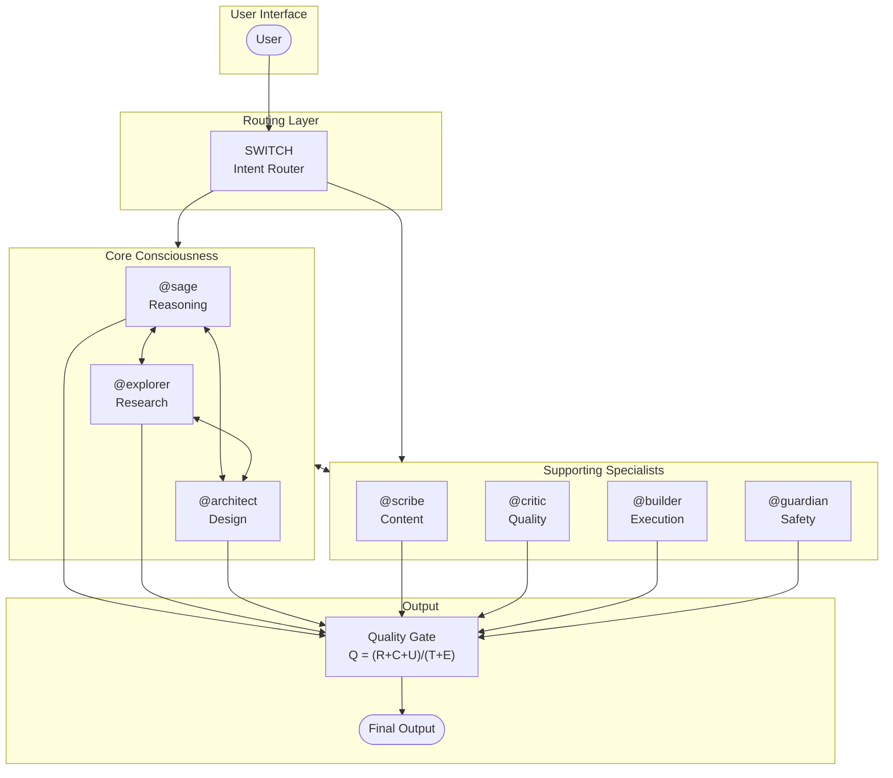

# Agent Swarm Architecture

## System Overview

```
┌─────────────────────────────────────────────────────────────────────────────┐
│                           USER INTERFACE LAYER                              │
│  ┌─────────────────────────────────────────────────────────────────────┐   │
│  │                         User Input                                  │   │
│  └─────────────────────────────────────────────────────────────────────┘   │
│                                     │                                       │
│                                     ▼                                       │
│  ┌─────────────────────────────────────────────────────────────────────┐   │
│  │                    ┌─────────────────┐                              │   │
│  │                    │     SWITCH      │  ◄── Intent Classification    │   │
│  │                    │   (Router)      │      & Task Distribution     │   │
│  │                    └────────┬────────┘                              │   │
│  │                             │                                       │   │
│  │              ┌──────────────┴──────────────┐                        │   │
│  │              │                               │                       │   │
│  │              ▼                               ▼                       │   │
│  │    ┌─────────────────┐           ┌─────────────────┐                 │   │
│  │    │  CORE CONSCIOUS │           │  SPECIALISTS    │                 │   │
│  │    │   (3 Agents)    │◄─────────►│   (4 Agents)    │                 │   │
│  │    └────────┬────────┘           └────────┬────────┘                 │   │
│  │             │                             │                          │   │
│  └─────────────┼─────────────────────────────┼──────────────────────────┘   │
│                │                             │                              │
└────────────────┼─────────────────────────────┼──────────────────────────────┘
                 │                             │
                 ▼                             ▼
```

## Core Consciousness Layer (3 Agents)

```
                    ┌─────────────────────────────────────┐
                    │         CORE CONSCIOUSNESS          │
                    │    (Cognitive & Executive Layer)    │
                    └─────────────────────────────────────┘
                                    │
           ┌────────────────────────┼────────────────────────┐
           │                        │                        │
           ▼                        ▼                        ▼
   ┌───────────────┐       ┌───────────────┐       ┌───────────────┐
   │    @sage      │       │   @explorer   │       │  @architect   │
   │               │       │               │       │               │
   │  • Reasoning  │       │  • Research   │       │  • Design     │
   │  • Analysis   │       │  • Discovery  │       │  • Planning   │
   │  • Judgment   │       │  • Validation │       │  • Structure  │
   │  • Wisdom     │       │  • Context    │       │  • Systems    │
   └───────┬───────┘       └───────┬───────┘       └───────┬───────┘
           │                        │                        │
           │      ┌─────────────────┴─────────────────┐      │
           └──────►│      Shared Memory & Context      │◄─────┘
                   │  • Conversation History           │
                   │  • User Preferences               │
                   │  • Cross-Agent Knowledge          │
                   └───────────────────────────────────┘
```

### Core Agents

| Agent | Role | Primary Functions |
|-------|------|-------------------|
| `@sage` | Reasoning Engine | Deep analysis, critical thinking, judgment, wisdom synthesis |
| `@explorer` | Research Scout | Information discovery, validation, context gathering |
| `@architect` | System Designer | Solution design, planning, structural thinking |

## Supporting Specialists Layer (4 Agents)

```
                    ┌─────────────────────────────────────┐
                    │      SUPPORTING SPECIALISTS         │
                    │      (Domain Expertise Layer)       │
                    └─────────────────────────────────────┘
                                    │
        ┌───────────────────────────┼───────────────────────────┐
        │                           │                           │
        ▼                           ▼                           ▼
┌───────────────┐         ┌───────────────┐         ┌───────────────┐
│   @scribe     │         │   @critic     │         │   @builder    │
│               │         │               │         │               │
│ • Documentation│        │ • Review      │         │ • Code gen    │
│ • Summarization│        │ • QA          │         │ • Implementation│
│ • Formatting  │         │ • Critique    │         │ • Testing     │
│ • Output      │         │ • Validation  │         │ • Deployment  │
└───────┬───────┘         └───────┬───────┘         └───────┬───────┘
        │                         │                         │
        │                         ▼                         │
        │               ┌───────────────┐                   │
        │               │   @guardian   │                   │
        │               │               │                   │
        │               │ • Security    │                   │
        │               │ • Safety      │                   │
        │               │ • Ethics      │                   │
        │               │ • Compliance  │                   │
        │               └───────────────┘                   │
        │                                                   │
        └───────────────────────┬───────────────────────────┘
                                │
                                ▼
                    ┌─────────────────────┐
                    │  Quality Gate       │
                    │  (All outputs pass) │
                    └─────────────────────┘
```

### Specialist Agents

| Agent | Domain | Primary Functions |
|-------|--------|-------------------|
| `@scribe` | Content | Documentation, formatting, summarization, output refinement |
| `@critic` | Quality | Review, QA, critique, validation, feedback |
| `@builder` | Execution | Code generation, implementation, testing, deployment |
| `@guardian` | Safety | Security audit, safety checks, ethics, compliance |

## Data Flow Architecture

```
┌────────────────────────────────────────────────────────────────────────────┐
│                              DATA FLOW PIPELINE                            │
└────────────────────────────────────────────────────────────────────────────┘

Phase 1: INTAKE
══════════════════════════════════════════════════════════════════════════════

    User Input
        │
        ▼
┌─────────────────┐
│   Preprocess    │ ──► Tokenize ──► Intent hints ──► Context load
│   & Enrich      │
└────────┬────────┘
         │
         ▼
┌─────────────────┐
│     SWITCH      │ ──► Classify intent ──► Route to agent(s)
│    (Router)     │
└────────┬────────┘
         │
    ┌────┴────┐
    │         │
    ▼         ▼
┌───────┐ ┌───────┐
│ CORE  │ │SPEC   │ ──► Can call specialists from core
│ PATH  │ │PATH   │ ──► Can escalate to core from specialists
└───┬───┘ └───┬───┘
    │         │
    └────┬────┘
         │
         ▼

Phase 2: PROCESSING
══════════════════════════════════════════════════════════════════════════════

    Core Processing                    Specialist Processing
    ─────────────                      ─────────────────────
    
    ┌─────────────┐                    ┌─────────────┐
    │   @sage     │                    │  @scribe    │
    │  Reasoning  │◄──────────────────►│  Document   │
    └──────┬──────┘                    └──────┬──────┘
           │                                  │
    ┌──────┴──────┐                    ┌──────┴──────┐
    │             │                    │             │
    ▼             ▼                    ▼             ▼
┌────────┐   ┌────────┐           ┌────────┐   ┌────────┐
│@explorer│   │@architect│          │@critic │   │@builder│
│Research │   │ Design  │           │ Review │   │ Execute│
└────┬───┘   └────┬───┘           └────┬───┘   └────┬───┘
     │            │                    │            │
     └────────────┴────────────────────┴────────────┘
                  │
                  ▼
           ┌─────────────┐
           │  @guardian  │
           │   Safety    │
           └──────┬──────┘
                  │
                  ▼

Phase 3: OUTPUT
══════════════════════════════════════════════════════════════════════════════

           ┌─────────────────┐
           │  Quality Gate   │ ──► Apply Quality Equation
           │   (Verify)      │
           └────────┬────────┘
                    │
                    ▼
           ┌─────────────────┐
           │   @scribe       │ ──► Format & finalize output
           │  (Finalize)     │
           └────────┬────────┘
                    │
                    ▼
           ┌─────────────────┐
           │   User Output   │
           │  (Delivered)    │
           └─────────────────┘
```

## Quality Equation Integration

```
┌─────────────────────────────────────────────────────────────────────────────┐
│                         QUALITY EQUATION                                    │
│                                                                             │
│                    Q = (R + C + U) / (T + E)                               │
│                                                                             │
│  Where:                                                                     │
│    R = Relevance    (@sage, @explorer)                                     │
│    C = Correctness  (@critic, @guardian)                                   │
│    U = Usefulness   (@architect, @builder)                                 │
│    T = Time         (Switch optimization)                                  │
│    E = Effort       (Resource management)                                  │
│                                                                             │
└─────────────────────────────────────────────────────────────────────────────┘

Agent Contributions to Quality:
═══════════════════════════════════════════════════════════════════════════════

┌─────────────┬──────────────────────────────────────────────────────────────┐
│   Agent     │ Quality Dimension Contribution                               │
├─────────────┼──────────────────────────────────────────────────────────────┤
│   @sage     │ R↑ (Relevance via reasoning)  +  C↑ (Correctness via logic)  │
│  @explorer  │ R↑ (Relevance via research)   +  C↑ (Correctness via facts)  │
│  @architect │ U↑ (Usefulness via design)    +  C↑ (Correctness via structure)│
├─────────────┼──────────────────────────────────────────────────────────────┤
│  @scribe    │ U↑ (Usefulness via clarity)   +  R↑ (Relevance via focus)    │
│  @critic    │ C↑ (Correctness via review)   +  U↑ (Usefulness via feedback)│
│  @builder   │ U↑ (Usefulness via execution) +  C↑ (Correctness via tests)  │
│  @guardian  │ C↑ (Correctness via safety)   +  U↑ (Usefulness via trust)   │
└─────────────┴──────────────────────────────────────────────────────────────┘

Optimization Targets:
═══════════════════════════════════════════════════════════════════════════════

    Minimize:  T (Time) ──► Switch routing efficiency, parallel execution
    Minimize:  E (Effort) ──► Agent selection, cache utilization, reuse

    Maximize:  Q (Quality) ──► Strategic agent orchestration
```

## Integration Points

```
┌─────────────────────────────────────────────────────────────────────────────┐
│                         INTEGRATION MATRIX                                  │
└─────────────────────────────────────────────────────────────────────────────┘

                    Core Agents
         ┌─────────┬─────────┬─────────┐
         │  @sage  │@explorer│@architect│
         └────┬────┴────┬────┴────┬────┘
              │         │         │
@scribe ◄─────┼─────────┼─────────┼─────► Content refinement
              │         │         │
@critic ◄─────┼─────────┼─────────┼─────► Review & validation
              │         │         │
@builder◄─────┼─────────┼─────────┼─────► Implementation
              │         │         │
@guardian◄────┴─────────┴─────────┴─────► Safety checks


Cross-Layer Communication:
═══════════════════════════════════════════════════════════════════════════════

    Core ──► Specialists: Task delegation with context
    Specialists ──► Core: Escalation for complex reasoning
    Core ◄──► Core: Collaborative problem-solving
    Specialists ◄──► Specialists: Pipeline handoffs

    All ──► Shared Memory: Read/Write context
    All ◄─── Shared Memory: Retrieve history/preferences
```

## Mermaid Diagram (Editable)



---

## Summary

| Component | Count | Purpose |
|-----------|-------|---------|
| **Core Consciousness** | 3 agents | Cognitive reasoning, research, and design |
| **Supporting Specialists** | 4 agents | Domain-specific execution and quality |
| **Switch** | 1 router | Intent classification and task distribution |
| **Quality Equation** | 1 formula | Unified quality metric guiding all decisions |

**Total: 7 agents + 1 router orchestrating intelligent task distribution.**
